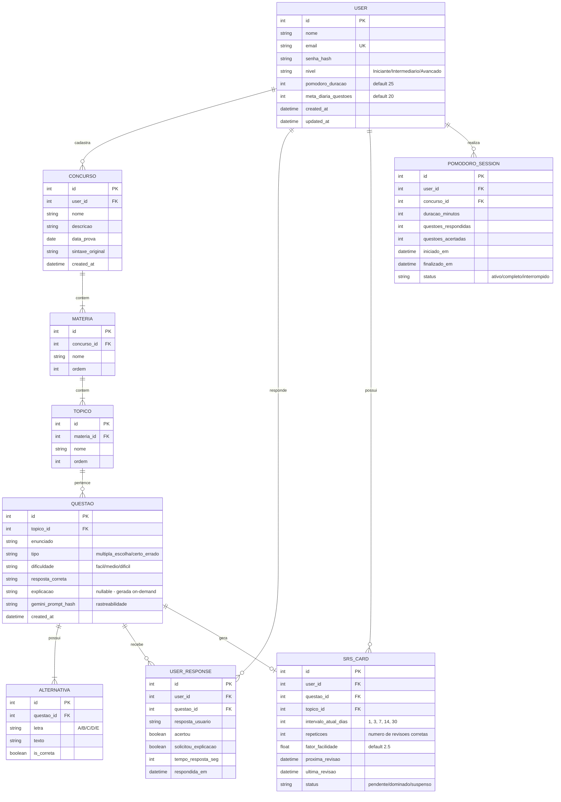

# 🗄️ Modelagem de Dados — QuestForge

## Diagrama Entidade-Relacionamento (ER)



---

## Detalhamento das Tabelas

### `users`
| Coluna | Tipo | Constraints | Descrição |
|--------|------|-------------|-----------|
| id | INTEGER | PK, AUTO_INCREMENT | Identificador único |
| nome | VARCHAR(100) | NOT NULL | Nome completo do usuário |
| email | VARCHAR(255) | NOT NULL, UNIQUE | E-mail para login |
| senha_hash | VARCHAR(255) | NOT NULL | Hash bcrypt da senha |
| nivel | VARCHAR(20) | DEFAULT 'Iniciante' | Nível calculado pelo sistema |
| pomodoro_duracao | INTEGER | DEFAULT 25 | Duração padrão do Pomodoro em minutos |
| meta_diaria_questoes | INTEGER | DEFAULT 20 | Meta diária de questões |
| created_at | TIMESTAMP | DEFAULT NOW() | Data de criação |
| updated_at | TIMESTAMP | ON UPDATE NOW() | Última atualização |

### `concursos`
| Coluna | Tipo | Constraints | Descrição |
|--------|------|-------------|-----------|
| id | INTEGER | PK, AUTO_INCREMENT | Identificador único |
| user_id | INTEGER | FK → users.id, NOT NULL | Quem cadastrou |
| nome | VARCHAR(200) | NOT NULL | Nome do concurso/edital |
| descricao | TEXT | NULLABLE | Descrição livre |
| data_prova | DATE | NULLABLE | Data prevista da prova |
| sintaxe_original | TEXT | NOT NULL | Texto original inserido pelo usuário |
| created_at | TIMESTAMP | DEFAULT NOW() | Data de criação |

### `materias`
| Coluna | Tipo | Constraints | Descrição |
|--------|------|-------------|-----------|
| id | INTEGER | PK, AUTO_INCREMENT | Identificador único |
| concurso_id | INTEGER | FK → concursos.id, ON DELETE CASCADE | Concurso pai |
| nome | VARCHAR(100) | NOT NULL | Nome da matéria |
| ordem | INTEGER | DEFAULT 0 | Ordem de exibição |

> **Constraint UNIQUE:** (concurso_id, nome) — não pode ter matérias duplicadas no mesmo concurso.

### `topicos`
| Coluna | Tipo | Constraints | Descrição |
|--------|------|-------------|-----------|
| id | INTEGER | PK, AUTO_INCREMENT | Identificador único |
| materia_id | INTEGER | FK → materias.id, ON DELETE CASCADE | Matéria pai |
| nome | VARCHAR(100) | NOT NULL | Nome do tópico |
| ordem | INTEGER | DEFAULT 0 | Ordem de exibição |

> **Constraint UNIQUE:** (materia_id, nome) — não pode ter tópicos duplicados na mesma matéria.

### `questoes`
| Coluna | Tipo | Constraints | Descrição |
|--------|------|-------------|-----------|
| id | INTEGER | PK, AUTO_INCREMENT | Identificador único |
| topico_id | INTEGER | FK → topicos.id, NOT NULL | Tópico relacionado |
| enunciado | TEXT | NOT NULL | Texto da questão |
| tipo | VARCHAR(20) | NOT NULL | "multipla_escolha" ou "certo_errado" |
| dificuldade | VARCHAR(10) | NOT NULL | "facil", "medio" ou "dificil" |
| resposta_correta | VARCHAR(5) | NOT NULL | Letra correta ou "certo"/"errado" |
| explicacao | TEXT | NULLABLE | Explicação gerada sob demanda |
| gemini_prompt_hash | VARCHAR(64) | NULLABLE | Hash do prompt para rastreabilidade |
| created_at | TIMESTAMP | DEFAULT NOW() | Data de criação |

### `alternativas`
| Coluna | Tipo | Constraints | Descrição |
|--------|------|-------------|-----------|
| id | INTEGER | PK, AUTO_INCREMENT | Identificador único |
| questao_id | INTEGER | FK → questoes.id, ON DELETE CASCADE | Questão pai |
| letra | CHAR(1) | NOT NULL | A, B, C, D ou E |
| texto | TEXT | NOT NULL | Texto da alternativa |
| is_correta | BOOLEAN | NOT NULL, DEFAULT FALSE | Se é a alternativa correta |

### `user_responses`
| Coluna | Tipo | Constraints | Descrição |
|--------|------|-------------|-----------|
| id | INTEGER | PK, AUTO_INCREMENT | Identificador único |
| user_id | INTEGER | FK → users.id, NOT NULL | Quem respondeu |
| questao_id | INTEGER | FK → questoes.id, NOT NULL | Questão respondida |
| resposta_usuario | VARCHAR(5) | NOT NULL | Resposta selecionada |
| acertou | BOOLEAN | NOT NULL | Se acertou ou errou |
| solicitou_explicacao | BOOLEAN | DEFAULT FALSE | Se pediu explicação |
| tempo_resposta_seg | INTEGER | NULLABLE | Tempo para responder em segundos |
| respondida_em | TIMESTAMP | DEFAULT NOW() | Quando respondeu |

### `srs_cards`
| Coluna | Tipo | Constraints | Descrição |
|--------|------|-------------|-----------|
| id | INTEGER | PK, AUTO_INCREMENT | Identificador único |
| user_id | INTEGER | FK → users.id, NOT NULL | Dono do card |
| questao_id | INTEGER | FK → questoes.id, NOT NULL | Questão para revisão |
| topico_id | INTEGER | FK → topicos.id, NOT NULL | Tópico para agrupamento |
| intervalo_atual_dias | INTEGER | DEFAULT 1 | Intervalo atual em dias |
| repeticoes | INTEGER | DEFAULT 0 | Quantas vezes acertou seguido |
| fator_facilidade | FLOAT | DEFAULT 2.5 | Fator SM-2 |
| proxima_revisao | TIMESTAMP | NOT NULL | Data da próxima revisão |
| ultima_revisao | TIMESTAMP | NULLABLE | Data da última revisão |
| status | VARCHAR(20) | DEFAULT 'pendente' | "pendente", "dominado", "suspenso" |

> **Constraint UNIQUE:** (user_id, questao_id) — cada questão só tem um card SRS por usuário.

### `pomodoro_sessions`
| Coluna | Tipo | Constraints | Descrição |
|--------|------|-------------|-----------|
| id | INTEGER | PK, AUTO_INCREMENT | Identificador único |
| user_id | INTEGER | FK → users.id, NOT NULL | Quem realizou |
| concurso_id | INTEGER | FK → concursos.id, NULLABLE | Concurso estudado |
| duracao_minutos | INTEGER | NOT NULL | Duração configurada |
| questoes_respondidas | INTEGER | DEFAULT 0 | Total respondidas |
| questoes_acertadas | INTEGER | DEFAULT 0 | Total acertadas |
| iniciado_em | TIMESTAMP | NOT NULL | Início da sessão |
| finalizado_em | TIMESTAMP | NULLABLE | Fim da sessão |
| status | VARCHAR(20) | DEFAULT 'ativo' | "ativo", "completo", "interrompido" |

---

## Índices Recomendados

```sql
-- Performance de consultas frequentes
CREATE INDEX idx_user_responses_user_id ON user_responses(user_id);
CREATE INDEX idx_user_responses_questao_id ON user_responses(questao_id);
CREATE INDEX idx_srs_cards_proxima_revisao ON srs_cards(user_id, proxima_revisao);
CREATE INDEX idx_srs_cards_status ON srs_cards(user_id, status);
CREATE INDEX idx_questoes_topico_id ON questoes(topico_id);
CREATE INDEX idx_materias_concurso_id ON materias(concurso_id);
CREATE INDEX idx_topicos_materia_id ON topicos(materia_id);
```
