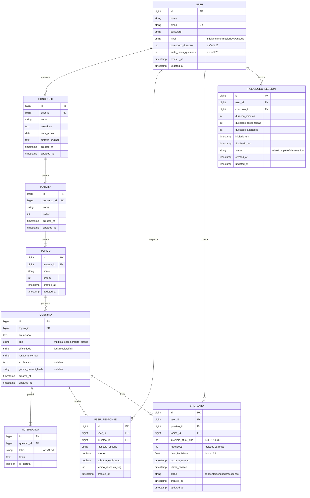

# 🗄️ Modelagem de Dados — QuestForge

## Diagrama Entidade-Relacionamento (ER)



---

## Migrations Laravel

### `users` (já vem com Laravel, adicionar campos extras)
```php
// Campos extras no User
$table->string('nivel')->default('Iniciante');
$table->integer('pomodoro_duracao')->default(25);
$table->integer('meta_diaria_questoes')->default(20);
```

### `concursos`
```php
Schema::create('concursos', function (Blueprint $table) {
    $table->id();
    $table->foreignId('user_id')->constrained()->cascadeOnDelete();
    $table->string('nome', 200);
    $table->text('descricao')->nullable();
    $table->date('data_prova')->nullable();
    $table->text('sintaxe_original');
    $table->timestamps();
});
```

### `materias`
```php
Schema::create('materias', function (Blueprint $table) {
    $table->id();
    $table->foreignId('concurso_id')->constrained()->cascadeOnDelete();
    $table->string('nome', 100);
    $table->integer('ordem')->default(0);
    $table->timestamps();

    $table->unique(['concurso_id', 'nome']);
});
```

### `topicos`
```php
Schema::create('topicos', function (Blueprint $table) {
    $table->id();
    $table->foreignId('materia_id')->constrained()->cascadeOnDelete();
    $table->string('nome', 100);
    $table->integer('ordem')->default(0);
    $table->timestamps();

    $table->unique(['materia_id', 'nome']);
});
```

### `questoes`
```php
Schema::create('questoes', function (Blueprint $table) {
    $table->id();
    $table->foreignId('topico_id')->constrained()->cascadeOnDelete();
    $table->text('enunciado');
    $table->string('tipo', 20);           // multipla_escolha ou certo_errado
    $table->string('dificuldade', 10);    // facil, medio, dificil
    $table->string('resposta_correta', 5);
    $table->text('explicacao')->nullable();
    $table->string('gemini_prompt_hash', 64)->nullable();
    $table->timestamps();

    $table->index('topico_id');
});
```

### `alternativas`
```php
Schema::create('alternativas', function (Blueprint $table) {
    $table->id();
    $table->foreignId('questao_id')->constrained()->cascadeOnDelete();
    $table->char('letra', 1);             // A, B, C, D, E
    $table->text('texto');
    $table->boolean('is_correta')->default(false);
});
```

### `user_responses`
```php
Schema::create('user_responses', function (Blueprint $table) {
    $table->id();
    $table->foreignId('user_id')->constrained()->cascadeOnDelete();
    $table->foreignId('questao_id')->constrained()->cascadeOnDelete();
    $table->string('resposta_usuario', 5);
    $table->boolean('acertou');
    $table->boolean('solicitou_explicacao')->default(false);
    $table->integer('tempo_resposta_seg')->nullable();
    $table->timestamp('created_at')->useCurrent();

    $table->index('user_id');
    $table->index('questao_id');
});
```

### `srs_cards`
```php
Schema::create('srs_cards', function (Blueprint $table) {
    $table->id();
    $table->foreignId('user_id')->constrained()->cascadeOnDelete();
    $table->foreignId('questao_id')->constrained()->cascadeOnDelete();
    $table->foreignId('topico_id')->constrained()->cascadeOnDelete();
    $table->integer('intervalo_atual_dias')->default(1);
    $table->integer('repeticoes')->default(0);
    $table->float('fator_facilidade')->default(2.5);
    $table->timestamp('proxima_revisao');
    $table->timestamp('ultima_revisao')->nullable();
    $table->string('status', 20)->default('pendente');
    $table->timestamps();

    $table->unique(['user_id', 'questao_id']);
    $table->index(['user_id', 'proxima_revisao']);
    $table->index(['user_id', 'status']);
});
```

### `pomodoro_sessions`
```php
Schema::create('pomodoro_sessions', function (Blueprint $table) {
    $table->id();
    $table->foreignId('user_id')->constrained()->cascadeOnDelete();
    $table->foreignId('concurso_id')->nullable()->constrained()->nullOnDelete();
    $table->integer('duracao_minutos');
    $table->integer('questoes_respondidas')->default(0);
    $table->integer('questoes_acertadas')->default(0);
    $table->timestamp('iniciado_em');
    $table->timestamp('finalizado_em')->nullable();
    $table->string('status', 20)->default('ativo');
    $table->timestamps();

    $table->index('user_id');
});
```

---

## Relacionamentos Eloquent

```php
// User.php
public function concursos() { return $this->hasMany(Concurso::class); }
public function responses() { return $this->hasMany(UserResponse::class); }
public function srsCards() { return $this->hasMany(SrsCard::class); }
public function pomodoroSessions() { return $this->hasMany(PomodoroSession::class); }

// Concurso.php
public function user() { return $this->belongsTo(User::class); }
public function materias() { return $this->hasMany(Materia::class); }

// Materia.php
public function concurso() { return $this->belongsTo(Concurso::class); }
public function topicos() { return $this->hasMany(Topico::class); }

// Topico.php
public function materia() { return $this->belongsTo(Materia::class); }
public function questoes() { return $this->hasMany(Questao::class); }

// Questao.php
public function topico() { return $this->belongsTo(Topico::class); }
public function alternativas() { return $this->hasMany(Alternativa::class); }
public function responses() { return $this->hasMany(UserResponse::class); }
public function srsCard() { return $this->hasOne(SrsCard::class); }
```
