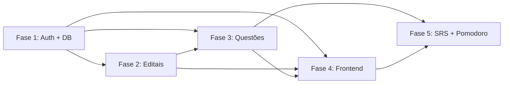

# 📅 Planejamento de Implementação — QuestForge

## Visão por Fases

O projeto será implementado em **5 fases incrementais**, onde cada fase entrega valor funcional independente. Cada fase pode ser testada e validada antes de avançar.

---

## Fase 1 — Fundação (Backend Core + Auth)

> **Objetivo:** Setup do projeto, banco de dados e autenticação funcional.
> **Estimativa:** 2-3 dias

### Tarefas

- [ ] Inicializar projeto Python com FastAPI
- [ ] Configurar estrutura de diretórios (`backend/app/`)
- [ ] Configurar SQLAlchemy + Alembic (migrações)
- [ ] Implementar modelo `User`
- [ ] Implementar endpoints de autenticação:
  - [ ] `POST /api/auth/register` — Cadastro
  - [ ] `POST /api/auth/login` — Login (retorna JWT)
  - [ ] `GET /api/auth/me` — Dados do usuário autenticado
- [ ] Implementar middleware JWT (dependência FastAPI)
- [ ] Configurar CORS
- [ ] Criar `.env.example` e `config.py`
- [ ] Testes manuais com Thunder Client / curl

### Entregável
✅ API rodando com cadastro, login e autenticação JWT funcional.

### Critérios de Aceitação
- Cadastro cria usuário no banco com senha hasheada
- Login com credenciais válidas retorna JWT
- Endpoints protegidos rejeitam requisições sem token válido

---

## Fase 2 — Gestão de Editais (Syllabus Parser)

> **Objetivo:** CRUD de concursos com parser de sintaxe para criar matérias e tópicos.
> **Estimativa:** 2-3 dias

### Tarefas

- [ ] Implementar modelos `Concurso`, `Materia`, `Topico`
- [ ] Criar migração Alembic
- [ ] Implementar `syllabus_parser.py`:
  - [ ] Parser da sintaxe `Materia-topico1,topico2;Materia2-topico3`
  - [ ] Validação de formato
  - [ ] Tratamento de erros de sintaxe
- [ ] Implementar endpoints:
  - [ ] `POST /api/concursos` — Criar concurso + parse automático
  - [ ] `GET /api/concursos` — Listar concursos do usuário
  - [ ] `GET /api/concursos/{id}` — Detalhe com matérias e tópicos
  - [ ] `PUT /api/concursos/{id}` — Atualizar concurso
  - [ ] `DELETE /api/concursos/{id}` — Excluir concurso
  - [ ] `POST /api/concursos/{id}/materias` — Adicionar matéria
  - [ ] `POST /api/materias/{id}/topicos` — Adicionar tópico
- [ ] Testes do parser com diferentes inputs

### Entregável
✅ CRUD completo de concursos com parser funcional transformando texto em árvore relacional.

### Critérios de Aceitação
- Sintaxe `Portugues-interpretação,pontuação;Matematica-soma,divisao` cria estrutura correta
- Matérias e tópicos vinculados corretamente
- Cascade delete funciona (excluir concurso remove matérias e tópicos)

---

## Fase 3 — Motor de Questões (Gemini Integration)

> **Objetivo:** Geração de questões via Gemini, validação de respostas e explicações.
> **Estimativa:** 3-4 dias

### Tarefas

- [ ] Implementar `gemini_service.py`:
  - [ ] Conexão com Gemini API (google-generativeai SDK)
  - [ ] Template de prompt de geração
  - [ ] Template de prompt de explicação
  - [ ] Validação de JSON response
  - [ ] Retry com backoff exponencial
  - [ ] Fallback para JSON malformado
- [ ] Implementar modelos `Questao`, `Alternativa`, `UserResponse`
- [ ] Criar migração Alembic
- [ ] Implementar endpoints:
  - [ ] `POST /api/questoes/gerar` — Gerar bateria de questões
  - [ ] `GET /api/questoes/bateria/{id}` — Buscar bateria ativa
  - [ ] `POST /api/respostas` — Registrar resposta do usuário
  - [ ] `POST /api/questoes/{id}/explicacao` — Gerar explicação on-demand
- [ ] Implementar lógica de escopo (mesclado, matéria, tópico)
- [ ] Implementar dificuldade adaptativa
- [ ] Testes de integração com Gemini API

### Entregável
✅ Geração de questões funcional, validação de respostas com feedback e explicações sob demanda.

### Critérios de Aceitação
- Questões geradas no formato JSON correto e salvas no DB
- Respostas validadas com registro de acerto/erro
- Explicações retornadas de forma concisa e relevante
- Retry funciona em caso de falha da API

---

## Fase 4 — Frontend Completo

> **Objetivo:** Interface web completa e responsiva com todas as telas.
> **Estimativa:** 4-5 dias

### Tarefas

- [ ] Configurar Design System (CSS variables, cores, tipografia)
- [ ] Implementar SPA Router (vanilla JS)
- [ ] Implementar `api.js` (fetch wrapper com JWT)
- [ ] **Telas:**
  - [ ] Login / Cadastro
  - [ ] Home (lista de concursos)
  - [ ] Cadastro de Edital (input + preview da árvore)
  - [ ] Detalhe do Concurso (matérias e tópicos)
  - [ ] Configuração de Bateria (escopo, quantidade, dificuldade)
  - [ ] Quiz Interativo (questão, alternativas, feedback, explicação)
  - [ ] Dashboard de Vulnerabilidades (gráficos de desempenho)
- [ ] Implementar componentes reutilizáveis:
  - [ ] Toast notifications
  - [ ] Modal dialog
  - [ ] Loading spinner
  - [ ] Progress bar
- [ ] Design responsivo (mobile-first)
- [ ] Animações e micro-interações
- [ ] Dark mode

### Entregável
✅ Frontend completo e funcional, integrado com todos os endpoints da API.

### Critérios de Aceitação
- Todas as telas funcionais e responsivas
- Fluxo completo: cadastro → edital → questões → resposta → explicação
- Design premium com animações suaves
- Dark mode funcional

---

## Fase 5 — Features Avançadas (SRS + Pomodoro + Dashboard)

> **Objetivo:** Features de retenção e produtividade.
> **Estimativa:** 3-4 dias

### Tarefas

- [ ] **SRS (Revisão Espaçada):**
  - [ ] Implementar modelo `SRSCard`
  - [ ] Implementar `srs_service.py` com algoritmo SM-2 simplificado
  - [ ] Criar SRS cards automáticos ao errar ou pedir explicação
  - [ ] Endpoint `GET /api/srs/pendentes` — Questões para revisão
  - [ ] Atualizar geração de bateria para incluir questões SRS
  - [ ] Lógica de progressão de intervalos (1d → 3d → 7d → 14d → 30d)

- [ ] **Pomodoro:**
  - [ ] Implementar `pomodoro.js` (timer frontend)
  - [ ] Modelo `PomodoroSession`
  - [ ] Bloqueio de interface durante sessão ativa
  - [ ] Registro de sessões no backend
  - [ ] Pausas automáticas (5min / 15min a cada 4 blocos)

- [ ] **Dashboard Avançado:**
  - [ ] Taxa de erro por tópico (gráfico de barras)
  - [ ] Evolução temporal (gráfico de linha)
  - [ ] Heatmap de atividade
  - [ ] Alertas inteligentes ("Foque em X — taxa: 72%")
  - [ ] Endpoint `GET /api/dashboard/stats`
  - [ ] Endpoint `GET /api/dashboard/vulnerabilities`

### Entregável
✅ Sistema completo com SRS automático, Pomodoro integrado e Dashboard analítico.

### Critérios de Aceitação
- Questões erradas reaparecem após intervalo correto
- Pomodoro bloqueia interface e registra sessões
- Dashboard mostra dados reais e atualizados
- Alertas de vulnerabilidade funcionais

---

## Resumo Visual do Roadmap

```
Fase 1 ──► Fase 2 ──► Fase 3 ──► Fase 4 ──► Fase 5
 Auth       Editais    Questões   Frontend    SRS +
 + DB       + Parser   + Gemini   Completo    Pomodoro +
                                              Dashboard
 ▔▔▔▔▔      ▔▔▔▔▔▔▔    ▔▔▔▔▔▔▔   ▔▔▔▔▔▔▔▔    ▔▔▔▔▔▔▔▔▔
 2-3 dias   2-3 dias   3-4 dias   4-5 dias    3-4 dias
```

**Tempo total estimado: 14-19 dias de desenvolvimento**

---

## Dependências entre Fases



> **Nota:** As Fases 2 e 3 podem ter trabalho em paralelo após a Fase 1, mas o Motor de Questões (Fase 3) depende dos Tópicos da Fase 2 para gerar questões contextualizadas.
