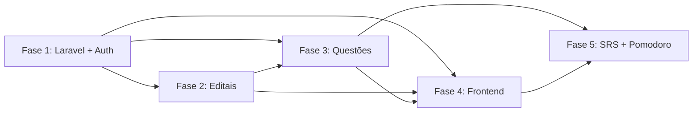

# 📅 Planejamento de Implementação — QuestForge

## Visão por Fases

O projeto será implementado em **5 fases incrementais**, onde cada fase entrega valor funcional independente. Cada fase pode ser testada e validada antes de avançar.

---

## Fase 1 — Fundação (Laravel + Auth + DB)

> **Objetivo:** Setup do projeto Laravel, banco de dados e autenticação funcional.
> **Estimativa:** 2-3 dias

### Tarefas

- [ ] Criar projeto Laravel 11 via Composer
- [ ] Configurar `.env` (SQLite para dev)
- [ ] Instalar e configurar Laravel Sanctum
- [ ] Criar migration `users` (campos do perfil de estudo inclusos)
- [ ] Implementar `AuthController`:
  - [ ] `POST /api/auth/register` — Cadastro
  - [ ] `POST /api/auth/login` — Login (retorna token Sanctum)
  - [ ] `GET /api/auth/me` — Dados do usuário autenticado
- [ ] Criar `RegisterRequest` e `LoginRequest` (Form Requests)
- [ ] Configurar CORS (`config/cors.php`)
- [ ] Configurar rotas em `routes/api.php`
- [ ] Testes manuais com Thunder Client / curl

### Entregável
✅ API Laravel rodando com cadastro, login e autenticação por token funcional.

### Critérios de Aceitação
- Cadastro cria usuário no banco com senha hasheada (bcrypt)
- Login com credenciais válidas retorna token Sanctum
- Endpoints protegidos rejeitam requisições sem token válido
- Validações de e-mail único e campos obrigatórios

---

## Fase 2 — Gestão de Editais (Syllabus Parser)

> **Objetivo:** CRUD de concursos com parser de sintaxe para criar matérias e tópicos.
> **Estimativa:** 2-3 dias

### Tarefas

- [ ] Criar migrations: `concursos`, `materias`, `topicos`
- [ ] Criar Models Eloquent com relacionamentos:
  - [ ] `Concurso` hasMany `Materia`
  - [ ] `Materia` hasMany `Topico`
  - [ ] `User` hasMany `Concurso`
- [ ] Implementar `SyllabusParserService`:
  - [ ] Parser da sintaxe `Materia-topico1,topico2;Materia2-topico3`
  - [ ] Validação de formato
  - [ ] Tratamento de erros de sintaxe
- [ ] Implementar `ConcursoController`:
  - [ ] `POST /api/concursos` — Criar concurso + parse automático
  - [ ] `GET /api/concursos` — Listar concursos do usuário
  - [ ] `GET /api/concursos/{id}` — Detalhe com matérias e tópicos
  - [ ] `PUT /api/concursos/{id}` — Atualizar concurso
  - [ ] `DELETE /api/concursos/{id}` — Excluir concurso (cascade)
  - [ ] `POST /api/concursos/{id}/materias` — Adicionar matéria
  - [ ] `POST /api/materias/{id}/topicos` — Adicionar tópico
- [ ] Criar `ConcursoRequest` (Form Request)
- [ ] Testes do parser com diferentes inputs

### Entregável
✅ CRUD completo de concursos com parser funcional transformando texto em árvore relacional.

### Critérios de Aceitação
- Sintaxe `Portugues-interpretação,pontuação;Matematica-soma,divisao` cria estrutura correta
- Matérias e tópicos vinculados corretamente
- Cascade delete funciona (excluir concurso remove matérias e tópicos)
- Apenas o dono do concurso pode editá-lo/excluí-lo

---

## Fase 3 — Motor de Questões (Gemini Integration)

> **Objetivo:** Geração de questões via Gemini, validação de respostas e explicações.
> **Estimativa:** 3-4 dias

### Tarefas

- [ ] Configurar `config/gemini.php` com variáveis de ambiente
- [ ] Implementar `GeminiService`:
  - [ ] Conexão HTTP com Gemini API (`Http::post()`)
  - [ ] Template de prompt de geração
  - [ ] Template de prompt de explicação
  - [ ] Validação de JSON response
  - [ ] Retry com backoff exponencial
  - [ ] Fallback para JSON malformado
- [ ] Criar migrations: `questoes`, `alternativas`, `user_responses`
- [ ] Criar Models Eloquent com relacionamentos
- [ ] Implementar `QuestaoController`:
  - [ ] `POST /api/questoes/gerar` — Gerar bateria de questões
  - [ ] `GET /api/questoes/bateria/{id}` — Buscar bateria ativa
  - [ ] `POST /api/respostas` — Registrar resposta do usuário
  - [ ] `POST /api/questoes/{id}/explicacao` — Gerar explicação on-demand
- [ ] Criar `GerarQuestoesRequest` (Form Request)
- [ ] Implementar lógica de escopo (mesclado, matéria, tópico)
- [ ] Implementar dificuldade adaptativa
- [ ] Testes de integração com Gemini API

### Entregável
✅ Geração de questões funcional, validação de respostas com feedback e explicações sob demanda.

### Critérios de Aceitação
- Questões geradas no formato JSON correto e salvas no DB
- Respostas validadas com registro de acerto/erro
- Explicações retornadas de forma concisa e relevante
- Retry funciona em caso de falha da API

---

## Fase 4 — Frontend React

> **Objetivo:** Interface web completa em React, responsiva, com todas as telas.
> **Estimativa:** 4-5 dias

### Tarefas

- [ ] Criar projeto React com Vite (`npm create vite@latest frontend -- --template react`)
- [ ] Instalar dependências: `react-router-dom`, `axios`, `recharts` (gráficos)
- [ ] Configurar Design System (`index.css` — variáveis CSS, cores, tipografia)
- [ ] Configurar Axios instance com interceptors JWT (`src/api/client.js`)
- [ ] Implementar `AuthContext` + `useAuth` hook
- [ ] Implementar `ProtectedRoute` component
- [ ] Configurar React Router em `App.jsx`
- [ ] **Pages:**
  - [ ] `Login.jsx` / `Register.jsx`
  - [ ] `Home.jsx` (lista de concursos)
  - [ ] `EditalForm.jsx` (input + preview da árvore)
  - [ ] `ConcursoDetail.jsx` (matérias e tópicos)
  - [ ] `QuizConfig.jsx` (configuração da bateria)
  - [ ] `QuizPlay.jsx` (quiz interativo com feedback instantâneo)
  - [ ] `Dashboard.jsx` (gráficos de desempenho com Recharts)
- [ ] **Components reutilizáveis:**
  - [ ] `Layout.jsx` (navbar + sidebar)
  - [ ] `Toast.jsx` (notificações)
  - [ ] `Modal.jsx` (dialog)
  - [ ] `Spinner.jsx` (loading)
  - [ ] `QuestionCard.jsx` (card de questão)
- [ ] Design responsivo (mobile-first)
- [ ] Animações e micro-interações (CSS transitions + framer-motion opcional)
- [ ] Dark mode

### Entregável
✅ Frontend React completo e funcional, integrado com todos os endpoints da API.

### Critérios de Aceitação
- Todas as telas funcionais e responsivas
- Fluxo completo: cadastro → edital → questões → resposta → explicação
- Design premium com animações suaves
- Dark mode funcional

---

## Fase 5 — Features Avançadas (SRS + Pomodoro + Dashboard)

> **Objetivo:** Features de retenção e produtividade.
> **Estimativa:** 3-4 dias

### Tarefas

- [ ] **SRS (Revisão Espaçada):**
  - [ ] Criar migration `srs_cards`
  - [ ] Implementar Model `SrsCard` com relacionamentos
  - [ ] Implementar `SrsService` com algoritmo SM-2 simplificado
  - [ ] Criar SRS cards automáticos ao errar ou pedir explicação
  - [ ] Endpoint `GET /api/srs/pendentes` — Questões para revisão
  - [ ] Atualizar geração de bateria para incluir questões SRS
  - [ ] Lógica de progressão de intervalos (1d → 3d → 7d → 14d → 30d)
  - [ ] Laravel Scheduler para verificar cards pendentes diariamente

- [ ] **Pomodoro:**
  - [ ] Implementar `PomodoroTimer.jsx` (componente React)
  - [ ] Implementar `usePomodoro` hook
  - [ ] Criar migration `pomodoro_sessions`
  - [ ] Model `PomodoroSession`
  - [ ] Bloqueio de interface durante sessão ativa
  - [ ] Registro de sessões no backend (`PomodoroController`)
  - [ ] Pausas automáticas (5min / 15min a cada 4 blocos)

- [ ] **Dashboard Avançado:**
  - [ ] Taxa de erro por tópico (gráfico de barras)
  - [ ] Evolução temporal (gráfico de linha)
  - [ ] Heatmap de atividade
  - [ ] Alertas inteligentes ("Foque em X — taxa: 72%")
  - [ ] `DashboardService` com queries otimizadas
  - [ ] Endpoint `GET /api/dashboard/stats`
  - [ ] Endpoint `GET /api/dashboard/vulnerabilities`

### Entregável
✅ Sistema completo com SRS automático, Pomodoro integrado e Dashboard analítico.

### Critérios de Aceitação
- Questões erradas reaparecem após intervalo correto
- Pomodoro bloqueia interface e registra sessões
- Dashboard mostra dados reais e atualizados
- Alertas de vulnerabilidade funcionais

---

## Resumo Visual do Roadmap

```
Fase 1 ──► Fase 2 ──► Fase 3 ──► Fase 4 ──► Fase 5
 Auth       Editais    Questões   Frontend    SRS +
 Laravel    + Parser   + Gemini   React       Pomodoro +
 Sanctum                         + Vite       Dashboard
 ▔▔▔▔▔      ▔▔▔▔▔▔▔    ▔▔▔▔▔▔▔   ▔▔▔▔▔▔▔▔    ▔▔▔▔▔▔▔▔▔
 2-3 dias   2-3 dias   3-4 dias   4-5 dias    3-4 dias
```

**Tempo total estimado: 14-19 dias de desenvolvimento**

---

## Dependências entre Fases



> **Nota:** As Fases 2 e 3 podem ter trabalho em paralelo após a Fase 1, mas o Motor de Questões (Fase 3) depende dos Tópicos da Fase 2 para gerar questões contextualizadas.

---

## Comandos Úteis (Laravel)

```bash
# Criar projeto
composer create-project laravel/laravel backend

# Rodar servidor de desenvolvimento
cd backend && php artisan serve

# Criar migration
php artisan make:migration create_concursos_table

# Rodar migrations
php artisan migrate

# Criar Model com migration, controller e form request
php artisan make:model Concurso -mcr

# Instalar Sanctum
php artisan install:api

# Limpar cache
php artisan cache:clear && php artisan config:clear
```
