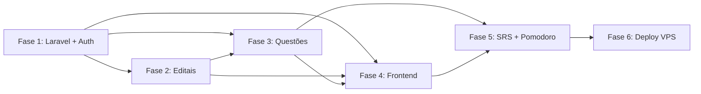

# 📅 Planejamento de Implementação — QuestForge

## Visão por Fases

O projeto será implementado em **5 fases incrementais**, onde cada fase entrega valor funcional independente. Cada fase pode ser testada e validada antes de avançar.

---

## Fase 1 — Fundação (Laravel + Auth + DB)

> **Objetivo:** Setup do projeto Laravel, banco de dados e autenticação funcional.
> **Estimativa:** 2-3 dias

### Tarefas

- [x] Preparar dependências essenciais (Composer 2.9.5 instalado)
- [x] Preparar criação do projeto Laravel 11
- [x] Configurar projeto e **Docker** (PHP 8.4 + Nginx + PostgreSQL + Redis)
- [x] Configurar `backend/.env` (PostgreSQL + Redis via Docker)
- [x] Instalar e configurar Laravel Sanctum (`composer.json` atualizado)
- [x] Criar migration `users` (campos do perfil de estudo inclusos)
- [x] Implementar `AuthController`:
  - [x] `POST /api/auth/register` — Cadastro
  - [x] `POST /api/auth/login` — Login (retorna token Sanctum)
  - [x] `GET /api/auth/me` — Dados do usuário autenticado
  - [x] `POST /api/auth/logout` — Logout (revoga token)
  - [x] `PUT /api/auth/profile` — Atualizar perfil
- [x] Criar `RegisterRequest` e `LoginRequest` (Form Requests com mensagens em PT-BR)
- [x] Configurar CORS e rotas em `bootstrap/app.php` e `routes/api.php`
- [x] Criar `config/gemini.php`
- [ ] Subir containers e testar com curl / Thunder Client

### Entregável
✅ API Laravel rodando com cadastro, login e autenticação por token funcional.

### Critérios de Aceitação
- Cadastro cria usuário no banco com senha hasheada (bcrypt)
- Login com credenciais válidas retorna token Sanctum
- Endpoints protegidos rejeitam requisições sem token válido
- Validações de e-mail único e campos obrigatórios

---

## Fase 2 — Gestão de Editais (Syllabus Parser)

> **Objetivo:** CRUD de concursos com parser de sintaxe para criar matérias e tópicos.
> **Estimativa:** 2-3 dias

### Tarefas

- [x] Criar migrations: `concursos`, `materias`, `topicos`
- [x] Criar Models Eloquent com relacionamentos:
  - [x] `Concurso` hasMany `Materia` + hasManyThrough `Topico`
  - [x] `Materia` hasMany `Topico`
  - [x] `User` hasMany `Concurso`
- [x] Implementar `SyllabusParserService`:
  - [x] Parser da sintaxe `Materia-topico1,topico2;Materia2-topico3`
  - [x] Validação de formato com mensagens em PT-BR
  - [x] Suporte a hífens nos nomes das matérias
  - [x] Deduplicação automática de tópicos repetidos
  - [x] Execução em transação DB atômica
- [x] Implementar `ConcursoController`:
  - [x] `POST /api/concursos/preview` — Preview da estrutura sem salvar
  - [x] `POST /api/concursos` — Criar concurso + parse automático
  - [x] `GET /api/concursos` — Listar concursos do usuário
  - [x] `GET /api/concursos/{id}` — Detalhe com matérias e tópicos
  - [x] `PUT /api/concursos/{id}` — Atualizar concurso (re-parse se sintaxe mudou)
  - [x] `DELETE /api/concursos/{id}` — Excluir concurso (cascade)
  - [x] `POST /api/concursos/{id}/materias` — Adicionar matéria avulsa
  - [x] `POST /api/materias/{id}/topicos` — Adicionar tópico avulso
  - [x] `DELETE /api/materias/{id}` — Remover matéria
  - [x] `DELETE /api/topicos/{id}` — Remover tópico
- [x] Criar `ConcursoRequest` (Form Request com validação em PT-BR)
- [ ] Testes com curl / Thunder Client após containers subirem

### Entregável
✅ CRUD completo de concursos com parser funcional transformando texto em árvore relacional.

### Critérios de Aceitação
- Sintaxe `Portugues-interpretação,pontuação;Matematica-soma,divisao` cria estrutura correta
- Matérias e tópicos vinculados corretamente
- Cascade delete funciona (excluir concurso remove matérias e tópicos)
- Apenas o dono do concurso pode editá-lo/excluí-lo

---

## Fase 3 — Motor de Questões (Gemini Integration)

> **Objetivo:** Geração de questões via Gemini, validação de respostas e explicações.
> **Estimativa:** 3-4 dias

### Tarefas

- [ ] Configurar `config/gemini.php` com variáveis de ambiente
- [ ] Implementar `GeminiService`:
  - [ ] Conexão HTTP com Gemini API (`Http::post()`)
  - [ ] Template de prompt de geração
  - [ ] Template de prompt de explicação
  - [ ] Validação de JSON response
  - [ ] Retry com backoff exponencial
  - [ ] Fallback para JSON malformado
- [ ] Criar migrations: `questoes`, `alternativas`, `user_responses`
- [ ] Criar Models Eloquent com relacionamentos
- [ ] Implementar `QuestaoController`:
  - [ ] `POST /api/questoes/gerar` — Gerar bateria de questões
  - [ ] `GET /api/questoes/bateria/{id}` — Buscar bateria ativa
  - [ ] `POST /api/respostas` — Registrar resposta do usuário
  - [ ] `POST /api/questoes/{id}/explicacao` — Gerar explicação on-demand
- [ ] Criar `GerarQuestoesRequest` (Form Request)
- [ ] Implementar lógica de escopo (mesclado, matéria, tópico)
- [ ] Implementar dificuldade adaptativa
- [ ] Testes de integração com Gemini API

### Entregável
✅ Geração de questões funcional, validação de respostas com feedback e explicações sob demanda.

### Critérios de Aceitação
- Questões geradas no formato JSON correto e salvas no DB
- Respostas validadas com registro de acerto/erro
- Explicações retornadas de forma concisa e relevante
- Retry funciona em caso de falha da API

---

## Fase 4 — Frontend React

> **Objetivo:** Interface web completa em React, responsiva, com todas as telas.
> **Estimativa:** 4-5 dias

### Tarefas

- [x] Criar projeto React com Vite (`npm create vite@latest frontend -- --template react`)
- [x] Instalar dependências: `react-router-dom`, `axios`, `recharts` (gráficos)
- [x] Configurar Design System (`index.css` — variáveis CSS, cores, tipografia, glassmorphism)
- [x] Configurar Axios instance com interceptors JWT (`src/api/client.js`)
- [x] Implementar `AuthContext` + `useAuth` hook
- [x] Implementar `ProtectedRoute` component
- [x] Configurar React Router em `App.jsx`
- [x] **Pages:**
  - [x] `Login.jsx` / `Register.jsx`
  - [x] `Home.jsx` (lista de concursos com modal de exclusão)
  - [x] `EditalForm.jsx` (input + preview da árvore sem salvar)
  - [x] `ConcursoDetail.jsx` (matérias e tópicos clícaveis)
  - [x] `QuizConfig.jsx` (seleção encadeada concurso → matéria → tópico)
  - [x] `QuizPlay.jsx` (quiz com Pomodoro integrado, explicacão IA, tela de resultado)
  - [x] `Dashboard.jsx` (gráficos Recharts com API real)
  - [x] `SrsResumo.jsx` (resumo do progresso SRS)
- [x] **Components reutilizáveis:**
  - [x] `Layout.jsx` (sidebar com NavLink ativo)
  - [x] `Toast.jsx` (notificações com Context)
  - [x] `Modal.jsx` (dialog com overlay blur)
  - [x] `Spinner.jsx` (loading configurável)
- [x] Dark mode
- [x] Animações e micro-interações (CSS transitions)

### Entregável
✅ Frontend React completo e funcional, integrado com todos os endpoints da API.

### Critérios de Aceitação
- Todas as telas funcionais e responsivas
- Fluxo completo: cadastro → edital → questões → resposta → explicação
- Design premium com animações suaves
- Dark mode funcional

---

## Fase 5 — Features Avançadas (SRS + Pomodoro + Dashboard)

> **Objetivo:** Features de retenção e produtividade.
> **Estimativa:** 3-4 dias

### Tarefas

- [x] **SRS (Revisão Espaçada):**
  - [x] Criar migration `srs_cards`
  - [x] Implementar Model `SrsCard` com relacionamentos
  - [x] Implementar `SrsService` com algoritmo SM-2 simplificado
  - [x] SRS cards criados automaticamente via `QuestaoController.registrarResposta`
  - [x] Endpoint `GET /api/srs/pendentes` — Questões para revisão
  - [x] Endpoint `GET /api/srs/resumo` — Progresso e agenda 7d
  - [x] Endpoint `GET /api/srs/cards` — Cards paginados com filtro por status
  - [x] Endpoint `POST /api/srs/{id}/resetar` — Reseta card para revisão imediata
  - [x] Lógica de progressão de intervalos (1d → 3d → 7d → 14d → 30d)

- [x] **Pomodoro:**
  - [x] Implementar `usePomodoro` hook (fases automáticas, notificações do browser)
  - [x] Implementar `usePomodoroSession` hook (persistência no backend)
  - [x] Criar migration `pomodoro_sessions`
  - [x] Model `PomodoroSession` com helpers de duração e taxa de acerto
  - [x] Pausas automáticas (5min / 15min a cada 4 blocos)
  - [x] `PomodoroController` com iniciar/atualizar/finalizar/histórico/resumo
  - [x] Timer do Pomodoro integrado na tela `QuizPlay.jsx`

- [x] **Dashboard Avançado:**
  - [x] Taxa de erro por matéria (gráfico de barras horizontal)
  - [x] Evolução temporal (gráfico de linha — 7 dias)
  - [x] Distribuição por matéria (pizza donut)
  - [x] Barras de progresso por matéria com cores adaptativas
  - [x] `DashboardController` com queries SQL otimizadas
  - [x] Endpoint `GET /api/dashboard/stats`
  - [x] Endpoint `GET /api/dashboard/vulnerabilities`
  - [x] Card de SRS pendentes com botão de ação
  - [x] Card de métricas Pomodoro dos últimos 30 dias

### Entregável
✅ Sistema completo com SRS automático, Pomodoro integrado e Dashboard analítico.

### Critérios de Aceitação
- Questões erradas reaparecem após intervalo correto
- Pomodoro bloqueia interface e registra sessões
- Dashboard mostra dados reais e atualizados
- Alertas de vulnerabilidade funcionais

---

## Fase 6 — Deploy e Ambiente VPS (Docker)

> **Objetivo:** Estruturar um deploy simples, resiliente e escalável para uma VPS.
> **Estimativa:** 1-2 dias

### Tarefas

- [ ] Criar/Customizar `docker-compose.yml` e `Dockerfile` de produção (Nginx + PHP 8.4 + DB)
- [ ] Criar script `deploy.sh` simples para a VPS (git pull, build, migrate, restart docker)
- [ ] Configurar banco de dados robusto (PostgreSQL/MySQL) via Docker na VPS
- [ ] Configurar acessos e proxy reverso

### Entregável
✅ Aplicação QuestForge em Produção rodando dockerizada em uma VPS.

---

## Resumo Visual do Roadmap

```
Fase 1 ──► Fase 2 ──► Fase 3 ──► Fase 4 ──► Fase 5 ──► Fase 6
 Auth       Editais    Questões   Frontend    SRS +      Deploy
 Laravel    + Parser   + Gemini   React       Pomo       VPS
 ▔▔▔▔▔      ▔▔▔▔▔▔▔    ▔▔▔▔▔▔▔   ▔▔▔▔▔▔▔▔    ▔▔▔▔▔▔     ▔▔▔▔▔▔
 2-3 dias   2-3 dias   3-4 dias   4-5 dias    3-4 dias   1-2 dias
```

**Tempo total estimado: 15-21 dias de desenvolvimento**

---

## Dependências entre Fases



> **Nota:** As Fases 2 e 3 podem ter trabalho em paralelo após a Fase 1, mas o Motor de Questões (Fase 3) depende dos Tópicos da Fase 2 para gerar questões contextualizadas.

---

## Comandos Úteis (Laravel)

```bash
# Criar projeto
composer create-project laravel/laravel backend

# Rodar servidor de desenvolvimento
cd backend && php artisan serve

# Criar migration
php artisan make:migration create_concursos_table

# Rodar migrations
php artisan migrate

# Criar Model com migration, controller e form request
php artisan make:model Concurso -mcr

# Instalar Sanctum
php artisan install:api

# Limpar cache
php artisan cache:clear && php artisan config:clear
```
